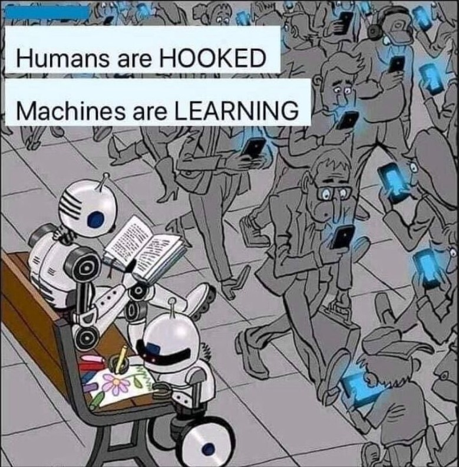

# 🌍 NaxionAI Freelancers
### Freelance | Innovation Hub | Graphic Design | Web Dev | Software Dev | Under the umbrella of Variety & Co.

  

  <strong>Empowering freelancers. Elevating businesses. Delivering multi-service tech solutions across Africa and beyond.</strong>

 

### 🔹 Who We Are

**NaxionAI Freelancers** is an agile freelance collective built entirely around a flexible, project‑driven, and talent‑powered model. We represent an elite network of independent professionals collaborating to deliver premium solutions in technology, design, and machine learning. 

> 💡 **The Core Philosophy:** We break down the barriers of traditional corporate firms. By uniting diverse freelance experts under one roof, we provide clients with a seamless, cost-effective, one‑stop ecosystem for cutting-edge development.
>
> 🌱 *“Munhu munhu muvanhu”* — **UBUNTU** (I am because we are).

 

### 🛠️ Ecosystem & Services

We bridge the gap between academic precision and commercial scalability.

| Service | Description | Status |
| :--- | :--- | :--- |
| **🌐 Apps & Websites** | Custom, responsive web platforms and mobile applications tailored to your business goals. | **Active** |
| **🧠 AI & Machine Learning** | Predictive modeling, intelligent automation, data analysis, and custom AI architectures. | **Active** |
| **🚀 Innovation & Upgrades** | Modernizing legacy codebases, system optimization, and integrating next-gen features. | **Active** |
| **🔧 TechDoctor** | Comprehensive hardware repairs, software troubleshooting, and system optimization. | **Active** |
| **💻 FullStack Solutions** | End-to-end architecture combining robust backends with immersive frontends. | **Coming Soon** |

 

<!--- Image --->

    

 

### 🚀 Technologies & Frameworks

Our collective adapts seamlessly to any client-preferred tech stack. Our core toolkit includes:

  
#### Web & Application Development
| React | Next.js | Django | Node.js | TypeScript | JavaScript |
| :---: | :---: | :---: | :---: | :---: | :---: |
|  |  |  |  |  |  |

#### Data Science & Artificial Intelligence
| Python3 | PyTorch | Jupyter | Anaconda |
| :---: | :---: | :---: | :---: |
|  |  |  |  |

#### Databases, Tools & Core Languages
| MySQL | Mongo | C# | Postgres | SupaBase | Stripe | Expo |
| :---: | :---: | :---: | :---: | :---: | :---: | :---: |
|  |  |  |  |  |  |  |

 

### 🎯 Strategic Vision & Value

*   **The Short‑Term:** Rapid, affordable deployment of websites, ML MVPs, and technical troubleshooting for startups, small-to-medium enterprises (SMEs), and individuals.
*   **The Long‑Term:** Evolving into Africa’s premier freelance marketplace—pioneering decentralized technical collaboration, creative branding networks, and highly scalable AI products.

 

###  Why Clients Choose NaxionAI:
*   **Agility & Flexibility:** Scale talent up or down based exactly on project needs.
*   **Cross-Disciplinary Power:** Access software engineers, data scientists, and hardware specialists under a single contract.
*   **Uncompromising Standard:** Driven strictly by consistency, hard work, and technical discipline.

 

### 🤝 Connect & Collaborate

Whether you want to build a product, join our network, or optimize your current infrastructure, we want to hear from you.

*   **Fork & Contribute:** All public repositories are open for collaborative improvements! (First ask for permission) 
*   **Hub Portfolio:** 
*   **Direct Inquiry:** 
*   **Professional Network:** 
*   **Variety Vault & Co. Portfolio:** 

 

<!--- Image --->

  

  

  Proudly Assembled with Nature - @marknature 🌿

